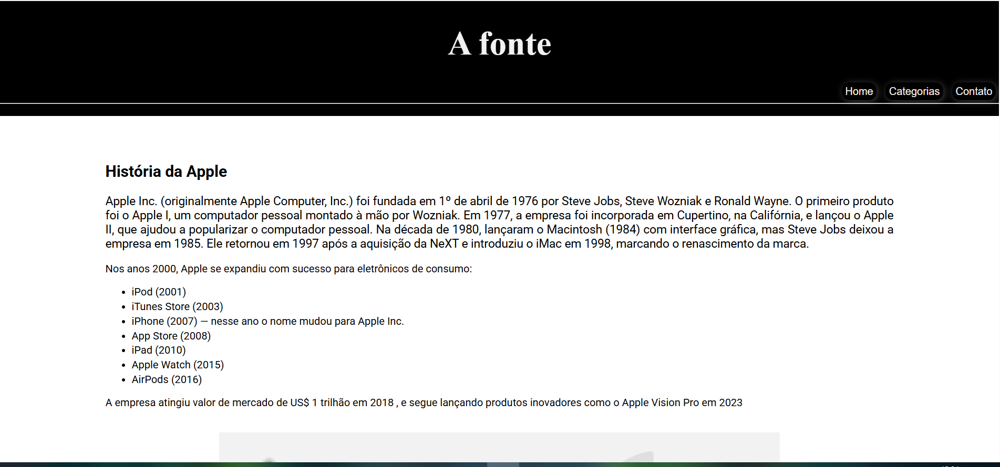

# Apple History - "A Fonte" Website



An informative website about the history of Apple Inc., from its founding to the present day.

## 📌 About the Project

This project is a responsive web page that tells the story of Apple, highlighting its main products and historical milestones. The site was developed using:

- Semantic HTML5
- Modern CSS3
- Clean and elegant design

## ✨ Features

- Header with navigation menu
- Content organized into sections
- Chronological list of key product launches
- Footer with update information
- Responsive design

## 🛠 Technologies Used

- **HTML5** – Content structure
- **CSS3** – Styling and layout
- **Google Fonts** – Typography (Roboto and Times New Roman)
- **GitHub Pages** – Hosting (optional)

## 🚀 How to View

1. Clone this repository:
   ```bash
   git clone https://github.com/your-username/apple-history.git
