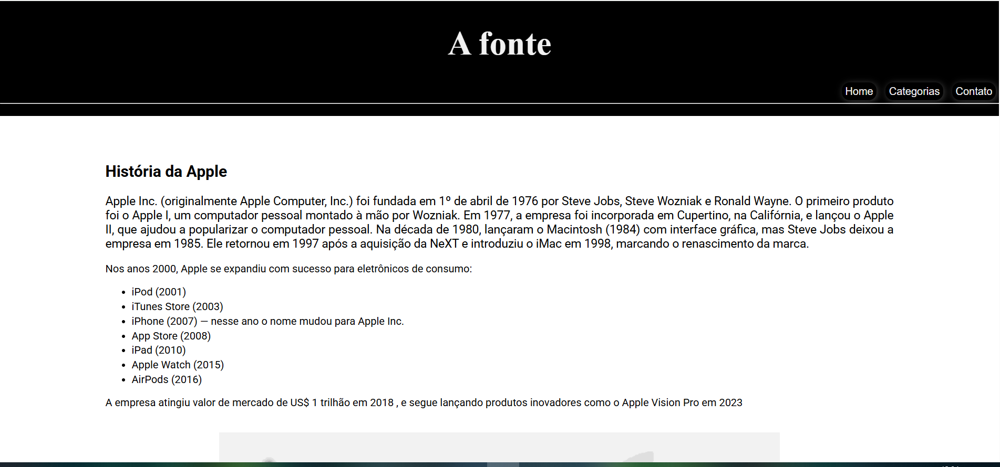

# História da Apple - Site "A Fonte"



Um site informativo sobre a história da Apple Inc., desde sua fundação até os dias atuais.

## 📌 Sobre o Projeto

Este projeto é uma página web responsiva que conta a trajetória da Apple, destacando seus principais produtos e marcos históricos. O site foi desenvolvido com:

- HTML5 semântico
- CSS3 moderno
- Design limpo e elegante

## ✨ Recursos

- Cabeçalho com menu de navegação
- Conteúdo organizado em seções
- Lista cronológica dos principais lançamentos
- Rodapé com informação de atualização
- Design responsivo

## 🛠 Tecnologias Utilizadas

- **HTML5** - Estrutura do conteúdo
- **CSS3** - Estilização e layout
- **Google Fonts** - Tipografia (Roboto e Times New Roman)
- **GitHub Pages** - Hospedagem (opcional)

## 🚀 Como Visualizar

1. Clone este repositório:
   ```bash
   git clone https://github.com/seu-usuario/historia-apple.git